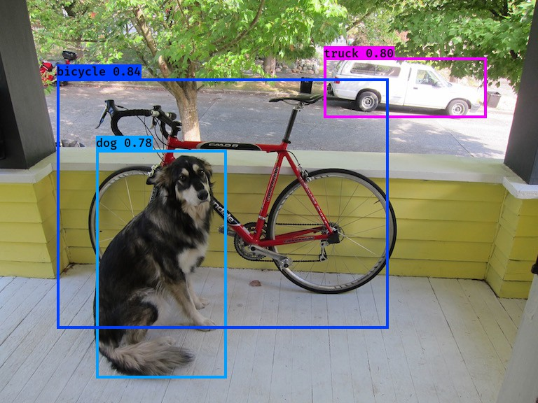
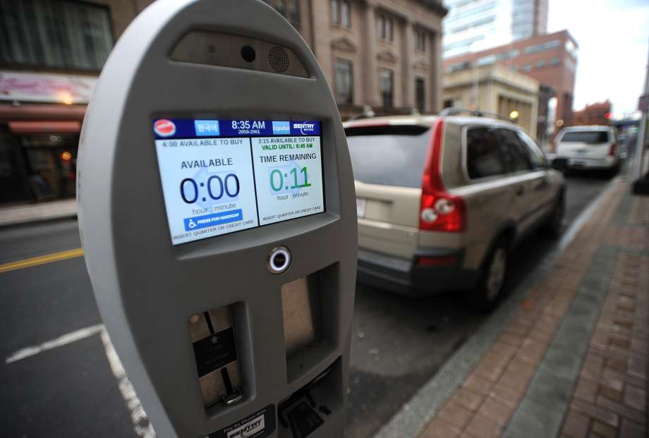

# Object-Detection (Yolo-v2)

<table>
<td> 
  
</td> 
<td> 
  
</td> 
</table>

<table>
<td> 
  
</td> 
<td> 
  
</td> 
</table>

<table>
<td> 
  
</td> 
<td> 
  
</td> 
</table>

<table>
<td> 
  
</td> 
<td> 
  
</td> 
</table>
